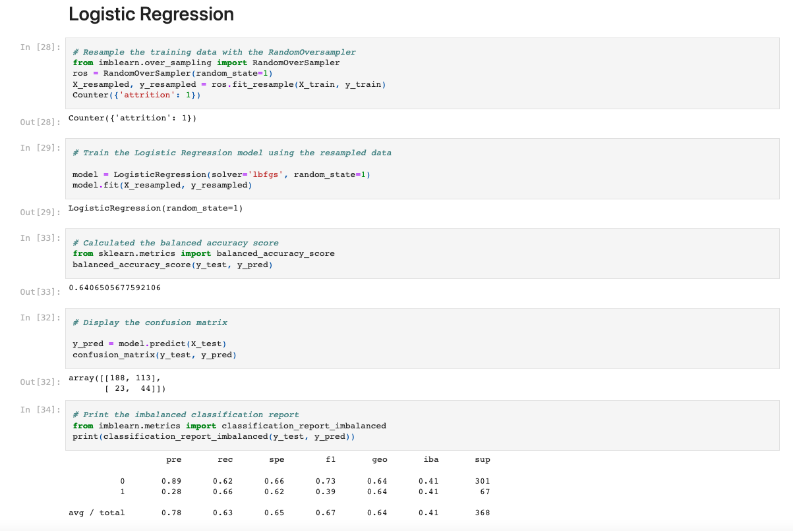
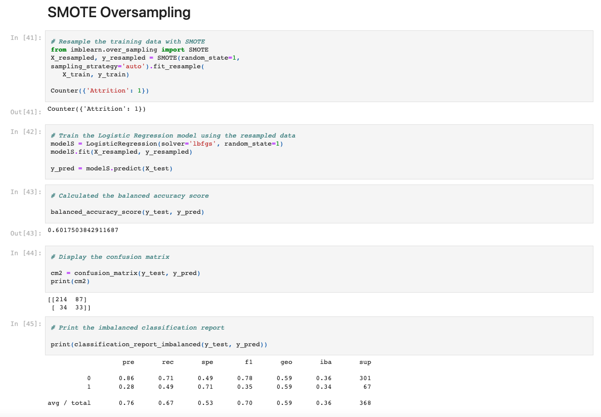
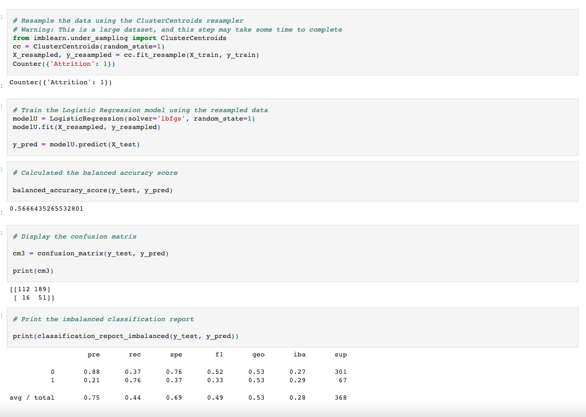
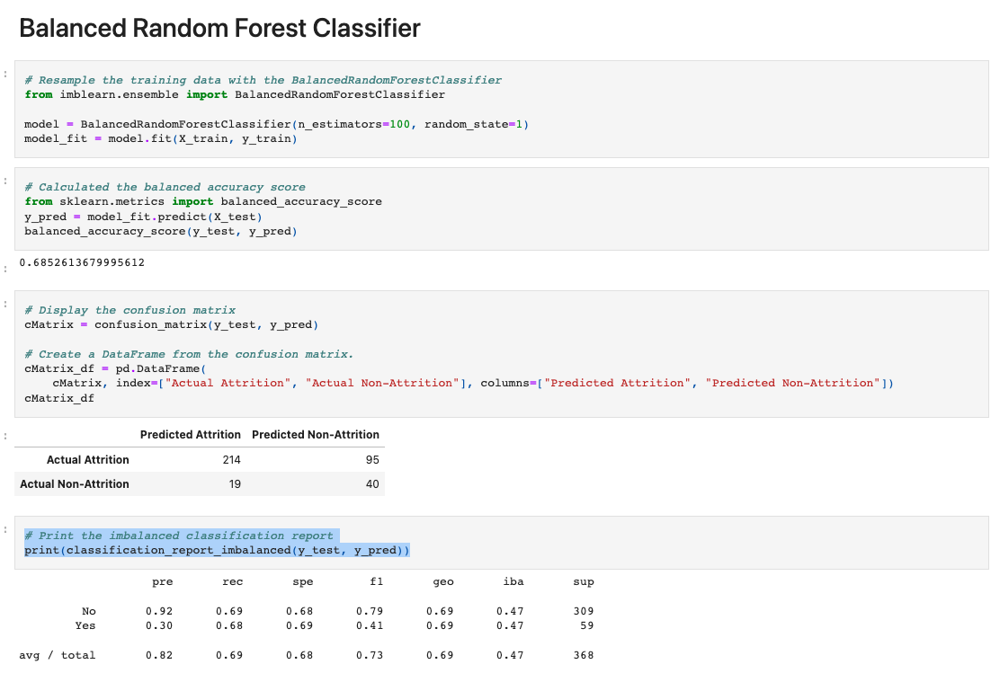
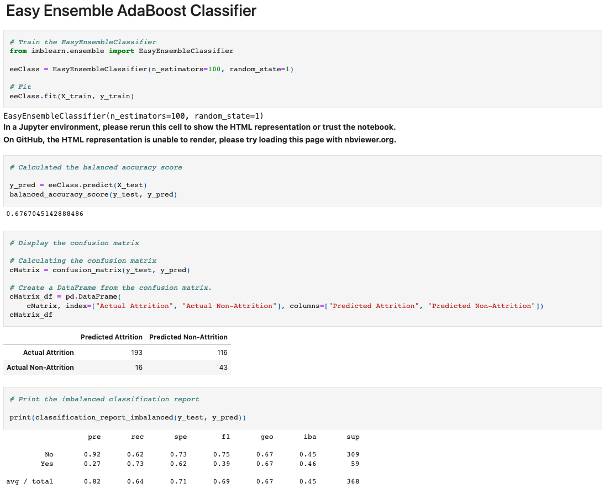

# Employee_Attrition

## Project overview

Employee retention is one of the most important factors that drives a company's competitive advantage. Conversly, employee attrition, particularly abnormal trends, impacts the company's bottom line.  As we know, attrition of employees cannot be avoided but there have several reasons for employee attrition. Our group will doing the data analysis using IBM HR Analytics Employee Attrition & Performance dataset to better help company understand and how to do on the interventions. It will be most effective in reducing unwanted attrition.

## Reason We Chose This Topic
Attrition is very relevant and relatable to most of us because we've all had jobs that we've left - for various reasons.   Each company is its own ecosystem made up of intricate factors that then make up its unique culture.  For this particular project, we will examine what is driving IBM employees in HR, Sales and Research & Development to leave, use the data to inform the areas the company need to assess and improve and also be able to accurately predict who are at risk of leaving based on the machine learning model we've created.

## Team Members:

- Sunny Wong (https://github.com/sunnycywong)

- Mei Ling Xue (https://github.com/mxx8813)

- Erich Engelhardt (https://github.com/Engelhardte)

- Sophia(xiaoshan) Zhou (https://github.com/JoJofia)

### Data resource:
   - Image:[link](https://lattice.com/library/what-is-employee-experience-vs-employee-engagement)  
   - Dataset[link](https://www.kaggle.com/datasets/pavansubhasht/ibm-hr-analytics-attrition-dataset)

=======
## Technology and Tools
Jupyter Notebook to support interactive data preprocessing
Pandas library for inspecting and cleaning the raw data
Psycopg2 for connecting data to the ML model
Scikit-learn to build machine learning models
Tableau for analysing and visualizations
Google Slides for a presentation

## Project Details
### Communication protocols: 

The team will leverage various communication channels to facilitate the project.

We will spend a large portion of virtual class time to plan, discuss, delegate, and support one another on task assignments and spend the time working together virtually.

Outside of dedicated class time on Tuesday and Thursday, the team will utilize a private Slack channel while working async and communicate updates, questions, etc. 

If needed, the team will also be setting up dedicated meetings outside of class hours. 

Below is an overview of the project phases

### Preliminary feature engineering and selection
The team will be using Postgres to feed data into our machine learning models. 

### In order to use the best model for the analysis, the team will be testing out all six models.
 - Naive Random Oversampling
 - SMOTE Oversampling
 - Undersampling - cluster centroids algorithms
 - Combination(Over and Under Sampling) - SMOTEENN algorithm
 - Balanced Random Forest Classifier
 - Easy Ensemble AdaBoost Classifier

After the results are pulled, the team will utilize Tableau to visualize the findings and insights. 

### Data exploration phase
The team will enter the data exploration phase after we select the data set foe the project.

### Preliminary data preprocessing:
  
In this pase, the team reviewed and discussed each data column in the raw file in order to determine which data columns we will keep or drop for the machine learning model, as well as which data types will need to be transformed in order to be consumed. 

Columns that were dropped are data that we anticipate are not the driving factors of the attrition and are therefore not necessary to include. For example, the employee count and over18 columns or departmentname.

 We will need to transfer certain data that are currently in string format into integer for machine learning purposes. For example, “attrition” is currently yes/no and will need to be converted to 0 and 1, gender (converting male and female to 0 and 1), and marital status (converting single, married, and divorced to 0, 1, and 2).

### Analysis phase
Once the team competes the data cleaning and extraction phase, we will build the features and target for model to feed the model.

### Model Choice
We decided to implement supervised machine learning using a logistic regression model. This is because the scenario we are studying involves multiple independent variables, but only has binary outcomes for the dependent variable: either the employee leaves the organization, or they do not. Within the data set, this is shown through the “Attrition” column’s possible values: yes or no. This value is not continuous, so we do not use a linear regression model. The model we developed will use the available data to put each new sample into one of two classes that each correspond to one of those two outcomes. One downside that we must keep in mind when using a logistic regression model is that it may be prone to overfitting caused by having many independent variables relative to the small size of the training set.

We lean away from undersampling, as the dataset we are using may not be large enough to facilitate cutting it even smaller. This makes oversampling more attractive, but we must also be wary of its inherent vulnerability to outliers causing inaccuracies in how it measures relationships between the dependent variable and the independent variables. Combination sampling would allow us to diminish the cons of using oversampling, although it also reintroduces the downsides of undersampling, which could be problematic due to the dataset’s small size. Therefore, we will likely test different sampling strategies to see how each performs in terms of accuracy and precision.

### Data resource:
   - Image:[link](https://lattice.com/library/what-is-employee-experience-vs-employee-engagement)  
   - Dataset[link](https://www.kaggle.com/datasets/pavansubhasht/ibm-hr-analytics-attrition-dataset)

## Findings - six different models
Before we start training a model, we have to partition our dataset into a training set and a test set or features and target. Total attrition in the dataset is 237, and non-attrition is 1233.

### **Logistic Regression**

- In the logistic Regression models, the accuracy score is 64.07%, witha  recall of 62% on actual attrition and 66% in non-attrition.

For this model, there are 301 non-attrition for the actual attrition and 67 actual occurrences for actual attrition. The precision for the actual attrition is low, indicating a large number of false positives, which indicates an unreliable positive classfication.
- The logistic regression model's accuracy is 64.7% and a low F1 Score an indication that it is not a good good model at classifying employee attrition.

### **Naive Random Oversampling**

- In the Naive Random Oversampling model, the accuracy score also is 64.07%, recall is 62% on actual attrition same with logistic Regression models and 66% in non-attrition.
This model also results in 301 non-attrition for the actual attrition and 67 actual occurrences for actual attrition. The precision for the actual attrition is low, indicating a large number of false positives, which indicates an unreliable positive classfication.
- The Naive Random Oversampling's accuracy is 64.7% and a low F1 Score an indication that it is not a good good model at classifying employee attrition.

### **SMOTE Oversampling**

- The SMOTE Oversampling yields an accuracy score of 60.18%, recall is 49% on actual attrition and 71% for non-attrition.
This model yields 301 non-attrition for actual attrition and 67 actual occurrences for actual attrition. And the precision for the actual attrition is 28% as low, indicating a large number of false positives, which indicates an unreliable positive classfication.

### **Undersampling**

- The Undersampling using cluster centroids algorithm model has an accuracy score of 56.66%, the recall is 76% on actual attrition and 37% on non-attrition.
This model yields 301 non-attrition for the actual attrition and 67 actual occurrences for actual attrition. And the precision for the actual attrition is 21% as low, indicating a large number of false positives, which indicates an unreliable positive classfication.

### **Combination(Over and Under Sampling)**
.png)
- In Combination(Over and Under Samplings using the SMOTEENN algorithm model has accuracy score is 64.39%, the recall in 75% on actual attrition and 54% in non-attrition.
For this models still stay on 301 non-attrition for the actual attrition and 67 actual occurrences for actual attrition. And the precision for the actual attrition is 27% asis low, indicating a large number of false positives, which indicates an unreliable positive classfication.

### **Balanced Random Forest Classifier**

The Balanced Random Forest Classifier model has accuracy score of 68.52%, the recall in 68% on actual attrition and 69% on non-attrition.
The model yields 309 non-attrition for the actual attrition and 59 actual occurrences for actual attrition. The precision for the actual attrition is 30% which means precision for the actual attrition is low, indicating a large number of false positives, which indicates an unreliable positive classfication.

### **Easy Ensemble AdaBoost Classifier**

  The Easy Ensmeble AdaBoost Classifier model has accuracy score of 67.67%, the recall is 73% on actual attrition and 62% on non-attrition.

This model yields 309 non-attrition for the actual attrition and 59 actual occurrences for actual attrition. The precision for the actual attrition is 27% which means precision for the actual attrition is low, indicating a large number of false positives, which indicates an unreliable positive classfication.

## Summary
Based on testing the 6 different kind of machine learning models and variability on the prediction that are significant indicators of employee attrition. Looking at the findings, we can safely conclude that the Balanced Random Forest Classifier model has the highest level of overall accuracy (68.52%) and is the best performing model compared to other sampling algorithms to analyze and therefore predict the contributing factors of employee attrition.

## Top Factors Contributing to Attrition

We selected a set of 16 features that we feel would most likely attribute to attrition, spanning compensation, performance, development & career growth, tenure and personal attributes.

The top five factors are Age, Hourly Rate, Years At Company, Total Working Years, and Percent Salary Hike.

## Google Slides Link
[Click here](https://docs.google.com/presentation/d/1tK68lEqBwnXk-U9_hVBMxHCFWIiPoHWBg3Ww6Z6_EX8/edit#slide=id.g13cb71ee761_0_0) to review our presentation slides

## Tableau Dashboard (Additional Insights)
[Click here](https://public.tableau.com/views/EmployeeAttrition_16582829561380/ByGender?:language=en-US&:display_count=n&:origin=viz_share_link) to see the interactive dashboard in Tableau

## Recommendations for Employers

1. Consider expanding the dataset to include departments outside of Sales, Research & Development and Human Resources to create a more accurate model that would be representative of the overall organization
The current model is only a sample population of 3 departments

2. Conduct further research & interviews internally for anecdotal trends that could potentially be driving attrition to strength the model

